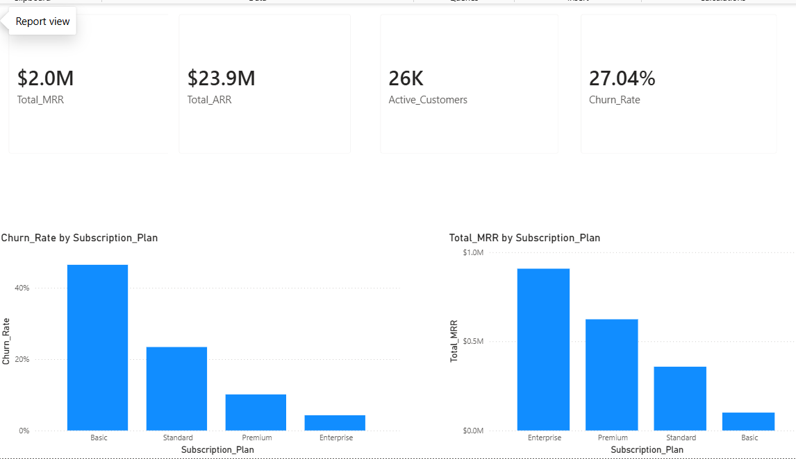
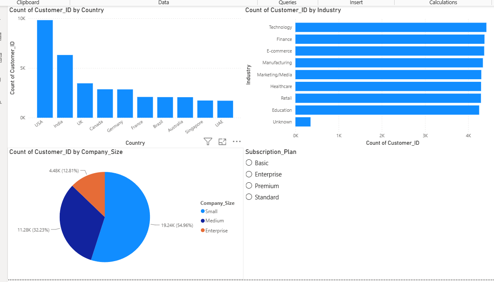
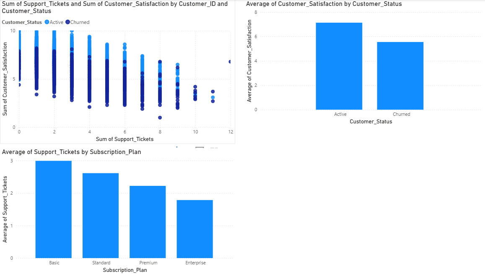

# SaaS Customer Analytics & Business Intelligence Dashboard

> An end-to-end analysis of a SaaS business's customer data, built to understand why customers churn and what can be done about it.

## Business Problem

SaaS businesses depend heavily on recurring revenue, which means keeping existing customers is just as important as getting new ones. Every customer who churns doesn't just mean one lost payment - it means losing their entire future value to the company. In this dataset, customers who churned stayed for an average of only 11.3 months, which shows retention is a real problem here, not just a minor issue.

For this project, I worked with 35,000 customer records for a SaaS company (synthetic data, built to reflect real business patterns) covering subscription plans, industries, countries, marketing channels, and customer support interactions. My goal was to find out why customers are leaving, which types of customers are most likely to churn, and what the business could do to reduce that churn. I did this by cleaning and exploring the data, calculating key business KPIs, writing 40 SQL queries for deeper analysis, and building a 6-page Power BI dashboard, ending with a set of business recommendations based on what the data showed.

---

## Dataset Overview

I generated a synthetic dataset of **35,000 customers and 22 columns**, but I didn't want it to be random - I built in business logic that mirrors how real SaaS companies behave, for example:

- Enterprise customers churn less than Basic or Pro plan customers, since bigger contracts usually mean more commitment and support
- Customers with low product usage and a high number of support tickets are more likely to churn - this is one of the clearest churn signals in real SaaS businesses
- Fields include subscription plan, monthly revenue, signup date, churn status, country, industry, marketing channel, number of support tickets, satisfaction score, product usage, and more

Because I built the churn logic in myself, I could then go and "discover" it through EDA and SQL - which is closer to how a real analyst would validate assumptions about a business, rather than just describing a dataset.

---

## Tools & Tech Stack

- **Python** (pandas, numpy) - data generation and cleaning
- **Jupyter Notebook** - all analysis, step by step
- **Matplotlib / Seaborn** - EDA visualizations
- **SQLite + SQL** - 40 business queries, from basic filtering to window functions
- **Power BI** - 6-page interactive dashboard
- **Git & GitHub** - version control

---

## Key Business KPIs

| Metric | Value |
|---|---|
| MRR (Monthly Recurring Revenue) | $1,990,023.59 |
| ARR (Annual Recurring Revenue) | $23,880,283.07 |
| ARPU (Average Revenue Per User) | $77.93 |
| CLTV (Customer Lifetime Value) | $1,467.62 |
| Churn Rate | 27.04% |
| Retention Rate | 72.96% |
| Avg. subscription length (churned customers) | 11.3 months |
| Avg. tenure so far (active customers) | 24.4 months |
| Upgrade rate | 32.54% |
| Downgrade rate | 14.02% |

These numbers came from `notebooks/04_kpi_calculations.ipynb` and are also saved in `reports/kpi_summary.txt`.

---

## Dashboard

I built a 6-page Power BI dashboard covering different angles of the business:

**Executive Overview**


**Customer Analytics**


**Support Analytics**


The full dashboard also includes Revenue Analytics, Subscription Analytics, and Marketing Analytics pages - the `.pbix` file is in the `dashboard/` folder if you want to open it and click through all six pages yourself.

---

## SQL Highlights

I wrote 40 SQL queries against the cleaned dataset, moving from simple business questions to more advanced ones using window functions - things like ranking customers by revenue within each plan, calculating running totals of MRR over time, and finding month-over-month churn trends. All queries are saved in the `sql/` folder, and the notebook that sets up the SQLite database is `notebooks/05_sql_setup.ipynb`.

---

## Business Recommendations

Based on the churn analysis, KPI calculations, and dashboard, I put together 4 data-backed recommendations for the business - covering which customer segments to prioritize for retention efforts, how support ticket volume relates to churn risk, and where marketing spend could be better targeted. Full write-up is in `reports/business_recommendations.md`.

---

## Folder Structure

```
SaaS-Analytics-Project/
- notebooks/
  - 01_generate_dataset.ipynb
  - 02_data_cleaning.ipynb
  - 03_eda.ipynb
  - 04_kpi_calculations.ipynb
  - 05_sql_setup.ipynb
- sql/
  - (40 business queries)
- dashboard/
  - SaaS_Dashboard.pbix
- images/
  - charts/
    - (EDA charts + dashboard screenshots)
- reports/
  - kpi_summary.txt
  - business_recommendations.md
- README.md
```


---

##  How to Run This Project

1. Clone this repo
2. Open the notebooks in order (01 to 05) in Jupyter Notebook
3. Run each notebook to regenerate the dataset, cleaning, EDA, KPIs, and SQL setup
4. Open `dashboard/SaaS_Dashboard.pbix` in Power BI Desktop to explore the full dashboard

---

##  About This Project

I built this as a portfolio project to practice end-to-end business analytics - going from a raw dataset all the way to a business-ready dashboard and recommendations, the way I'd approach it in a real analyst role. It follows the same structure I used for my earlier Netflix data analysis project.